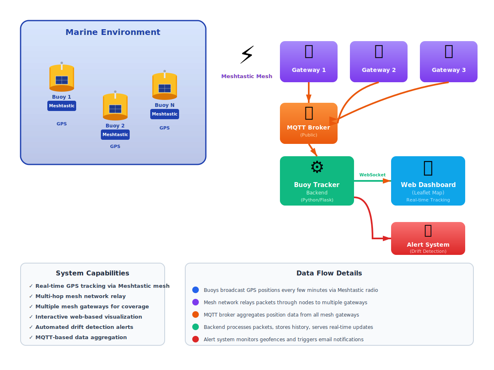

# Buoy Tracker

A real-time web interface for tracking Meshtastic mesh network nodes on a live map.

## The Problem

Racing buoys anchored in tidal waters face a critical risk: mooring chains wear out and break, causing buoys to break free and drift with the tide and wind. Once adrift, expensive buoys are difficult to recover—and AirTags on the buoys only work within Bluetooth range.

To solve this, buoys are equipped with **Meshtastic LoRa nodes** that transmit GPS positions via mesh network, with position packets received by gateway nodes and relayed through MQTT.

## System Architecture



**Buoy Tracker enables:**
- **Real-time tracking**: Map-based visualization of buoy positions as updates arrive
- **Drift detection**: Automatic alerts when buoys move beyond expected anchoring zones
- **Instant notifications**: Email alerts on drift detection
- **Signal monitoring**: Battery, RSSI, SNR tracking for network health
- **Mesh-range coverage**: Works across miles of mesh network, not limited to Bluetooth

**Data flow:** Buoys → Mesh Network → Gateways → MQTT Broker → Backend → Dashboard → Alerts

## Features

- **Real-time Node Tracking**: Live MQTT feed of mesh node positions
- **Interactive Map**: Leaflet-based map with color-coded status markers
- **Responsive Design**: Works seamlessly on desktop and mobile devices
  - **Desktop**: Fixed sidebar (320px) + full map view
  - **Mobile**: Overlay sidebar drawer with FAB controls
    - ☰ (Hamburger): Toggle sidebar
    - ⚙️ (Gear): Access settings menu
  - Touch-friendly controls and gestures on mobile
- **Node Details**: Battery levels, hardware info, last-seen times, and channel information
- **Status Color-Coding**: Blue (recent), Orange (stale), Red (very old)
- **Polling Progress Bar**: Visual indicator in the header showing time until next data refresh
  - White progress bar fills left to right, resets at each poll
  - Configurable polling interval (5-120 seconds; default is 10 seconds)
- **Time Indicators**: Each node card shows:
  - **LPU** (Last Position Update): Time since last GPS position packet
  - **SoL** (Sign of Life): Time since any packet received
  - **Position History**: Deduplicated by packet timestamp to show only unique positions (retransmitted packets are automatically filtered)
- **Signal Strength Monitoring**: Traffic light indicators for:
  - **Batt** (Battery): Voltage level status
  - **RSSI** (Signal Strength): Radio signal quality (-120 to -50 dBm)
  - **SNR** (Signal-to-Noise Ratio): Channel quality (-20 to +10 dB)
- **Signal History Visualization**: Click 📊 button on any node card to view:
  - Interactive histogram showing battery, RSSI, and SNR trends
  - Hover tooltips with detailed readings and timestamps
  - Full history (up to 2 weeks) of signal data
  - Compact floating window overlaying the map
- **Gateway Tracking**: Automatically discovers and tracks mesh gateways
  - Shows all gateways that relay packets from your monitored nodes
  - Displays signal strength and status for each gateway connection
  - Identifies relay patterns and network coverage
- **Dynamic Controls**: Real-time adjustment of tracker settings
  - **Movement Threshold**: Change alert distance (10-500m) without restarting
  - **Trail History**: Toggle position trail display and history length
  - **Low Battery Threshold**: Customize battery alert level
  - **API Polling Interval**: Adjust refresh rate
  - Settings persist for current session
- **Special Node Tracking**: Track specific nodes with home positions and movement alerts
  - Green dashed rings show movement threshold (configurable)
  - Red solid rings when nodes move beyond threshold
  - Light red card background alerts when nodes move outside expected range
  - Gray markers at home position until first GPS fix
  - Packet activity display with timestamps


## Quick Start

### Installation

```bash
# Install dependencies
pip install -r requirements.txt

# Create configuration files from templates
cp tracker.config.template tracker.config
cp secret.config.template secret.config

# Edit to customize MQTT broker, special nodes, etc.
nano tracker.config
nano secret.config

# Run the application
python3 run.py
```

The web interface will be available at `http://localhost:5102`

### Docker Deployment (Recommended)

**Option 1: Using Pre-built Docker Hub Image (Fastest)**

No build required—pull the pre-built container directly:

1. Create volume directories and configuration files from templates:
```bash
# Create directories for volumes (config, data, logs)
mkdir -p config data logs

# Download template files from GitHub
curl -o config/tracker.config.template https://raw.githubusercontent.com/guthip/buoy-tracker/main/tracker.config.template
curl -o config/secret.config.template https://raw.githubusercontent.com/guthip/buoy-tracker/main/secret.config.template

# Create configuration files from templates
cp config/tracker.config.template config/tracker.config
cp config/secret.config.template config/secret.config

# Customize for your environment
nano config/tracker.config  # MQTT broker, special nodes, etc.
nano config/secret.config   # Credentials (if using email alerts)
```

2. Create minimal docker-compose.yml:
```yaml
services:
  buoy-tracker:
    image: dokwerker8891/buoy-tracker:latest
    container_name: buoy-tracker
    restart: unless-stopped
    ports:
      - 5102:5102
    volumes:
      - ./config:/app/config
      - ./data:/app/data
      - ./logs:/app/logs
    environment:
      - MQTT_USERNAME
      - MQTT_PASSWORD
      - MQTT_KEY
      - ALERT_SMTP_USERNAME
      - ALERT_SMTP_PASSWORD
    healthcheck:
      test: [CMD, curl, -f, http://localhost:5102/api/status]
      interval: 30s
      timeout: 5s
      retries: 3
```

3. Start the service:
```bash
docker compose up -d
```

4. View logs:
```bash
docker compose logs -f
```

Access the web interface at **http://localhost:5102**

---

**Option 2: Using docker-compose with Source Code (Build Locally)**

Clone the repository and build from source:

1. Clone the repository:
```bash
git clone https://github.com/guthip/buoy-tracker.git
cd buoy-tracker
```

2. Create volume directories and configuration files from templates:
```bash
# Create directories for volumes (config, data, logs)
mkdir -p config data logs

# Create configuration files from templates in config directory
cp tracker.config.template config/tracker.config
cp secret.config.template config/secret.config

# Customize for your environment
nano config/tracker.config  # MQTT broker, special nodes, etc.
nano config/secret.config   # Credentials (if using email alerts)
```

3. Start the service:
```bash
docker compose up -d
```

4. View logs:
```bash
docker compose logs -f
```

Access the web interface at **http://localhost:5102**

**Volume Structure** (persists between container restarts):
- `./config/` → Configuration files (tracker.config, secret.config)
  - Mount to: `/app/config` in container
  - Editable on host; container reads from here
  - Create from templates during initial setup
- `./data/` → Application data (special_nodes.json, historical data)
  - Mount to: `/app/data` in container
  - Persists between restarts
- `./logs/` → Application logs
  - Mount to: `/app/logs` in container
  - Useful for debugging and monitoring

**Making Changes to Configuration:**
After editing files in `./config/`:
1. **Without restart** (recommended):
   ```bash
   curl -X POST http://localhost:5102/api/config/reload
   ```
2. **With restart** (if reload doesn't work):
   ```bash
   docker compose restart buoy-tracker
   ```

**Building Custom Images**

If you want to build a custom image with local modifications:

```bash
# Clone the repository
git clone https://github.com/guthip/buoy-tracker.git
cd buoy-tracker

# Build the Docker image
docker build -t my-buoy-tracker:latest .

# Run with docker-compose (update service image in docker-compose.yml to my-buoy-tracker:latest)
docker compose up -d
```

**What's Included:**
- ✅ Real-time Meshtastic mesh network node tracking
- ✅ In-memory history (position and telemetry) for current session
- ✅ Multi-platform: Works on Intel/AMD (x86_64), Apple Silicon (ARM64), Raspberry Pi (ARM64)

**Configuration files (created from templates in config volume):**
- `./config/tracker.config.template` → Reference template; copy to `config/tracker.config` and customize for your MQTT broker, special nodes, etc.
- `./config/secret.config.template` → Template showing required secrets; copy to `config/secret.config` and fill in real values

**Generated directories:**
- `./config/` → Configuration files (created from templates during setup; mounted as volume for easy editing)
- `./data/` → Application data persistence (history.json, special node tracking data)
- `./logs/` → Application logs (created automatically)


## Using the Interface

- **Node Sidebar**: Click any node to zoom map to its location
- **Map Markers**: Click markers for detailed popups with node information
  - Includes link to view node on [Meshtastic Map](https://meshtastic.liamcottle.net)
- **Menu Controls**:
  - Toggle "Show all nodes" to display all nodes (default: show only special nodes)
  - Toggle position trails to visualize movement history on the map
  - (Sorting is automatic: special nodes are always shown at the top, sorted alphabetically; all other nodes are sorted by most recently seen)
- **Movement Alerts**:
  - Green dashed circles show 50m threshold around special node home positions
  - Red solid circles appear when nodes exceed threshold
  - Card backgrounds turn light red when nodes move outside expected range
  - Browser alert on first threshold breach
- **Color Coding**:
  - 🔵 Blue: Recent (< 1 hour, configurable via `status_blue_threshold`)
  - 🟠 Orange: Stale (1-12 hours, configurable via `status_orange_threshold`)
  - 🔴 Red: Very old (> 12 hours)
  - 🟡 Gold: Special node active
  - ⚫ Dark Gray: Special node stale
  - ⚪ Light Gray: Awaiting GPS (at home position)
  - 🔴 Light Red Card: Special node outside expected range

## Configuration

Before running the application, create your volume directories and configuration files:

```bash
# Create directories for volumes
mkdir -p config data logs

# Create configuration files from templates
cp tracker.config.template config/tracker.config
cp secret.config.template config/secret.config

# Customize for your environment
nano config/tracker.config
nano config/secret.config  # Optional: only needed if using email alerts
```

### Applying Configuration Changes

After editing `tracker.config`, you have two options:

**Option 1: Reload without restart (recommended)**
```bash
# Reload config without stopping the server
curl -X POST http://localhost:5102/api/config/reload
```
This instantly applies changes to special nodes, coordinates, thresholds, and other settings.

**Option 2: Full restart** 
```bash
# Only needed if reload fails or for major updates
docker restart buoy-tracker  # Docker deployment
# or
pkill -f "python3 run.py"   # Direct Python execution
python3 run.py              # Restart locally
```

---

Edit `tracker.config` to customize settings:

### MQTT Connection
```ini
[mqtt]
broker = mqtt.bayme.sh
port = 1883
root_topic = msh/US/bayarea/2/e/
mqtt_channels = MediumSlow,MediumFast,LongFast
username = meshdev
password = large4cats
```

### Web Interface
```ini
[webapp]
host = 127.0.0.1
port = 5102
# Map center point. Supports both decimal and degrees-minutes formats:
# Decimal: default_center = 37.7749,-122.4194
# Degrees-minutes: default_center = N37° 33.81', W122° 13.13'
default_center = 37.7749,-122.4194
default_zoom = 13

# Node status color thresholds (in hours)
# Less than status_blue_threshold = blue (recent)
# Between blue and orange = orange (stale)
# Older than status_orange_threshold = red (very stale)
status_blue_threshold = 1
status_orange_threshold = 12

# Data polling interval (in seconds)
# How often the client polls the server for updates (applies to all endpoints)
# Default: 10 seconds (fast updates; rate limit auto-scales based on polling interval and special nodes)
# Range: 5-120 seconds (validated on startup)
# Note: Actual requests per interval = 3 base endpoints + N special nodes with trails enabled
# Examples (with 4 special nodes):
#   5 seconds  = 7,200/hour (aggressive, high server load)
#   10 seconds = 3,600/hour (default, frequent updates, excellent for demos)
#   30 seconds = 1,200/hour (balanced)
#   60 seconds = 600/hour (conservative)
#   120 seconds = 300/hour (low load)
# ⚠️ Progress bar in UI updates every 100ms, filling from 0-100% over the polling interval
api_polling_interval = 10
```

### User Interface Controls (Admin-Controlled)

Lock down the user interface to prevent end users from modifying settings. This is useful for public deployments where you want consistent configuration across all users:

```ini
[app_features]
# show_controls_menu: true/false
#   When true (default): Users see both "Legend" and "Controls" tabs in the settings menu
#   When false: Users only see "Legend" tab; the "Controls" tab is hidden
#
# IMPORTANT: This is admin-controlled only - end users cannot override this setting
#
# When disabled (false), end users cannot modify:
#   - Show/hide all nodes
#   - Show/hide gateways and connections
#   - Show/hide position trails
#   - Show/hide nautical markers
#   - Trail history hours
#   - Low battery threshold
#   - Movement threshold
#   - API polling interval
#
# Use this to enforce consistent configuration across all users
show_controls_menu = true

# Other UI features (users can modify if show_controls_menu = true)
show_all_nodes = false
show_gateways = false
show_position_trails = true
show_nautical_markers = true
trail_history_hours = 168
```

**Example: Lock Down Configuration for Public Display**

If you're running Buoy Tracker on a public display or shared access deployment:

```ini
[app_features]
show_controls_menu = false          # Hide controls from all users
show_all_nodes = false              # Only show special nodes
show_gateways = false               # Don't show gateways
show_position_trails = true         # Show position trails
show_nautical_markers = true        # Show chart markers
trail_history_hours = 168           # Show full week of history
```

With this configuration:
- ✅ Users see the map with your preconfigured settings
- ❌ Users cannot access the "Controls" tab to modify anything
- ❌ Settings are read-only - controlled by administrator only

**To re-enable controls:** Set `show_controls_menu = true` in `tracker.config` and reload the configuration.


API rate limits are **automatically calculated** based on polling interval and number of special nodes:
- **Formula**: `(3600 / polling_seconds) * (3_base_endpoints + N_special_nodes) * 2.0_safety_margin`, rounded up to nearest 10
- **Base endpoints**: `api/status`, `api/nodes`, `api/special/packets` = 3 requests per interval
- **Per special node**: `api/special/history` request when trails enabled = N additional requests
- **Safety multiplier**: 2.0x provides headroom for traffic spikes
- **Examples** (assuming 4 special nodes configured):
  - At 10-second polling → **3,600 requests/hour per IP address** (current default)
  - At 30-second polling → **1,200 requests/hour per IP address**
  - At 60-second polling → **600 requests/hour per IP address**
- **Dynamic scaling**: Rate limit automatically adjusts if you add/remove special nodes in `tracker.config`
- **Client Notification**: If a client exceeds the rate limit:
  - The **progress bar turns orange** and displays remaining pause time
  - Polling automatically pauses for 60 seconds, then resumes
  - Browser console shows `[RATELIMIT]` messages for debugging

**Progress Bar Indicator:**
- Located in the header bar (blue background)
- **White fill** shows time elapsed since last data poll
- **Fills 0→100%** over the polling interval
- **Orange display** during rate limit pause with countdown
- **Updates every 100ms** for smooth animation

The rate limit automatically adjusts based on polling interval and special node count:
```bash
# Change polling frequency in tracker.config:
api_polling_interval = 10   # Calculates rate limit from polling interval and special nodes in config
api_polling_interval = 30   # Lower polling = lower rate limit
api_polling_interval = 60   # Even more conservative
api_polling_interval = 120  # Very conservative, minimal server load
```

**Why auto-calculation?**
- Rate limit stays proportional to polling frequency
- Scales with number of special nodes configured
- No need to manually adjust multiple settings
- Prevents users from setting aggressive polling with restrictive rate limits
- One config value controls both behavior

### Special Nodes

Track specific nodes with extra detail:

```ini
[special_nodes_settings]
history_hours = 24
persist_path = data/special_history.json
stale_after_hours = 12
special_symbol = ⭐

# Format: node_id = label,home_lat,home_lon
# Coordinates support two formats:
# 1. Decimal degrees: 37.5637125,-122.2189855
# 2. Degrees-minutes: N37° 33.81', W122° 13.13'

# Examples with decimal format
3681533965 = SYCS,37.5637125,-122.2189855
492590216 = SYCE,37.5806826,-122.2175423

# Examples with degrees-minutes format
3681533965 = SYCS, N37° 33.81', W122° 13.13'
2512106321 = SYCA, N37° 31.94', W122° 10.31'
```

**Coordinate Formats**:
- **Decimal Degrees**: Standard latitude/longitude format (e.g., `37.5637125,-122.2189855`)
- **Degrees-Minutes**: Navigation format with hemisphere prefix (e.g., `N37° 33.81', W122° 13.13'`)
  - North/South for latitude (N = positive, S = negative)
  - East/West for longitude (E = positive, W = negative)
  - Format: `[NSEW]degrees° minutes'`
  - **Important**: Separate latitude and longitude with a comma

**Auto-Learn Origin** (Optional):
If you omit home coordinates in the config, the system automatically learns the origin from the **first GPS position the node reports**. This is useful when you don't have a precise home location yet:
```ini
[special_nodes]
# With coordinates (fixed origin for movement tracking)
3681533965 = SYCS, N37° 33.81', W122° 13.13'

# Without coordinates (learns from first GPS position received)
492590216 = SYCE
```
Once a position is learned, movement alerts are triggered relative to that first position. The origin updates if you later add home coordinates to the config.

**Movement Alerts**: Green dashed ring shows threshold boundary. Red solid ring appears when node moves beyond threshold from home position.

**Email Alerts**: Configure email notifications when nodes move outside the fence (see Email Alerts section below).

**Data Handling**: Special node data is tracked in memory during server operation:
- Position history (up to 2 weeks)
- Node info (battery, channel, telemetry, position, hardware)
- Packet history with full details
- Data persistence across server restarts is controlled by the `enable_persistence` setting in `tracker.config`:
  - When `false` (default): All history is cleared on server restart (recommended for production)
  - When `true`: Special node history persists across restarts (development/debugging only)
- Packet data includes: timestamps, packet types, channel info, position/telemetry/nodeinfo details

## Email Alerts

Send email notifications when special nodes move outside their home fence.

**⚠️ Platform-Specific Setup Required** - Email delivery method depends on your deployment environment.

### How It Works

- **Continuous Monitoring**: Alerts are sent whenever a special node is **outside its safe zone**
- **Smart Cooldown**: Only one email per node per cooldown period (default 1 hour, configurable)
- **No Redundant Alerts**: If a node stays outside the zone, you get one alert per cooldown period, not continuous emails
- **Includes**: Distance from home, battery level, timestamp, and tracker URL

### Platform-Specific Configuration

#### Production Deployment (Linux Servers) - RECOMMENDED

Linux servers have `sendmail` or `postfix` running by default. Use **localhost:25** (no credentials needed):

**In `tracker.config`:**
```ini

[alerts]
enabled = true
alert_cooldown = 1

tracker_url = http://your-server-address:5102
email_from = noreply@example.com

# SMTP Configuration for localhost:25 (sendmail/postfix)
smtp_host = localhost
smtp_port = 25
smtp_ssl = false
# No credentials needed for sendmail/postfix
```

**In `secret.config`:**
```ini
[alerts]
# Email recipient address(es)
email_to = your-email@example.com
```

Verify sendmail is running:
```bash
sudo systemctl status sendmail
# or
sudo systemctl status postfix

# If not installed:
sudo apt install sendmail  # Debian/Ubuntu
# or
sudo yum install sendmail   # RHEL/CentOS
```

#### Development Setup (Mac/Windows) - External SMTP Required

macOS and Windows don't have sendmail/postfix running by default. Use an external SMTP provider:

**In `tracker.config`:**
```ini

[alerts]
enabled = true
alert_cooldown = 1

tracker_url = http://localhost:5102
email_from = noreply@example.com

# Override SMTP settings for external provider
smtp_host = smtp.gmail.com
smtp_port = 587
smtp_ssl = false
```

**In `secret.config`:**
```ini
[alerts]
# Email recipient address(es)
email_to = your-email@example.com

# SMTP credentials (required for external providers)
smtp_username = your-email@gmail.com
smtp_password = your-app-password
```

See External SMTP Providers section below for setup instructions.

### External SMTP Providers

For development on Mac/Windows, use an external SMTP provider. All providers work the same way - configure in `tracker.config`:

**Gmail:**
```ini
[alerts]
smtp_host = smtp.gmail.com
smtp_port = 587
smtp_ssl = false
```

**SendGrid:**
```ini
[alerts]
smtp_host = smtp.sendgrid.net
smtp_port = 587
smtp_ssl = false
```

**AWS SES:**
```ini
[alerts]
smtp_host = email-smtp.us-west-2.amazonaws.com
smtp_port = 587
smtp_ssl = false
```

Then add credentials to `secret.config`:
```ini
[alerts]
smtp_username = your-email@gmail.com
smtp_password = your-app-password
email_to = recipient@example.com
```

### Security: Environment Variables

For production, use environment variables instead of storing credentials in config:

```bash
export ALERT_SMTP_USERNAME="your-email@gmail.com"
export ALERT_SMTP_PASSWORD="your-app-password"
```

Then leave `smtp_username` and `smtp_password` blank in `tracker.config`.

### Testing

Test your email configuration with these endpoints:

```bash
# Test configuration
curl -X POST http://localhost:5102/api/test-alert

# Test movement alert  
curl -X POST http://localhost:5102/api/test-alert-movement

# Test battery alert
curl -X POST http://localhost:5102/api/test-alert-battery
```

## API Reference

### Core Endpoints

- **`GET /api/nodes`** - All tracked nodes with position, battery, channel
- **`GET /api/status`** - MQTT connection status and node counts
- **`GET /api/recent_messages?limit=100`** - Recent MQTT messages for debugging
- **`GET /health`** - Health check

### Special Node Endpoints

- **`GET /api/special/history?node_id=<id>&hours=<hours>`** - Position history for a node
- **`GET /api/special/all_history?hours=<hours>`** - History for all special nodes
- **`GET /api/special/packets?limit=<n>`** - Recent packets from special nodes
- **`GET /api/special/packets/<node_id>?limit=<n>`** - Packets from specific node

### MQTT Control

- **`POST /api/mqtt/connect`** - Connect to MQTT broker
- **`POST /api/mqtt/disconnect`** - Disconnect from broker
- **`GET /api/mqtt/status`** - Connection details

## Project Structure

```
buoy_tracker/
├── src/
│   ├── main.py              # Flask app and routes
│   ├── mqtt_handler.py      # MQTT client and message handlers
│   ├── config.py            # Configuration loader
│   └── __init__.py
├── templates/
│   └── simple.html          # Web UI (Leaflet map)
├── static/
│   └── app.js               # Frontend JavaScript
├── data/                    # Data directory (in-memory only, not persisted)
├── tests/                   # Test suite
├── tracker.config.template  # Template (copy to tracker.config during setup)
├── secret.config.example    # Template (copy to secret.config during setup)
├── run.py                   # Application runner
└── requirements.txt         # Python dependencies
```

**Note:** `tracker.config` and `secret.config` are created from templates during deployment and are not included in the repository.

## Development

### Running Tests

```bash
pytest tests/
```

### Technology Stack

- Python 3.13+ with Flask 3.x
- Meshtastic MQTT JSON library
- Leaflet.js + OpenStreetMap
- paho-mqtt for MQTT client

## License

[Add license information here]

## Development

The application provides a RESTful API for programmatic access to node data:

### Status Endpoints

- **`GET /api/status`**  
  Returns MQTT connection status and node counts
  ```json
  {
    "mqtt_connected": true,
    "nodes_tracked": 42,
    "nodes_with_position": 38
  }
  ```

- **`GET /health`**  
  Simple health check endpoint
  ```json
  {"status": "ok"}
  ```

### Node Data Endpoints

- **`GET /api/nodes`**  
  Returns all tracked nodes with their current status, position, battery, and channel information
  ```json
  {
    "nodes": [
      {
        "id": 123456789,
        "name": "Node Name",
        "short": "NODE",
        "lat": 37.7749,
        "lon": -122.4194,
        "alt": 10,
        "hw_model": "TBEAM",
        "channel": 0,
        "channel_name": "MediumFast",
        "modem_preset": "MEDIUM_FAST",
        "role": "CLIENT",
        "battery": 85,
        "status": "blue",
        "is_special": false,
        "has_fix": true,
        "age_min": 5
      }
    ],
    "count": 1
  }
  ```

- **`GET /api/recent_messages?limit=100`**  
  Returns recent raw MQTT messages for debugging
  ```json
  {
    "recent": [...],
    "count": 100
  }
  ```

### Special Node Endpoints

Special nodes are configured in `tracker.config` for enhanced tracking:

- **`GET /api/special/history?node_id=<id>&hours=<hours>`**  
  Get position history for a specific special node
  - `node_id` (required): Node ID to query
  - `hours` (optional): Hours of history (default: 24)
  ```json
  {
    "node_id": 123456789,
    "hours": 24,
    "points": [
      {
        "timestamp": 1699999999.123,
        "latitude": 37.7749,
        "longitude": -122.4194,
        "altitude": 10
      }
    ],
    "count": 1
  }
  ```

- **`GET /api/special/all_history?hours=<hours>`**  
  Get position history for all special nodes
  ```json
  {
    "hours": 24,
    "histories": {
      "123456789": [...]
    }
  }
  ```

- **`GET /api/special/packets?limit=<n>`**  
  Get recent packets for all special nodes (default limit: 50)
  ```json
  {
    "packets": {
      "123456789": [
        {
          "timestamp": 1699999999.123,
          "packet_type": "position",
          "latitude": 37.7749,
          "longitude": -122.4194,
          "battery_level": 85,
          "voltage": 4.1,
          "channel_utilization": 5.2,
          "air_util_tx": 1.3
        }
      ]
    },
    "count": 1
  }
  ```

- **`GET /api/special/packets/<node_id>?limit=<n>`**  
  Get recent packets for a specific special node
  ```json
  {
    "node_id": 123456789,
    "packets": [...],
    "count": 1
  }
  ```

### MQTT Control Endpoints

- **`POST /api/mqtt/connect`**  
  Manually connect to MQTT broker

- **`POST /api/mqtt/disconnect`**  
  Disconnect from MQTT broker

- **`GET /api/mqtt/status`**  
  Get MQTT connection details

### Running Tests

```bash
pytest tests/
```

### Code Style

This project follows PEP 8 guidelines. Use `black` for code formatting and `flake8` for linting.

## Contributing

1. Create a feature branch
2. Make your changes
3. Write/update tests
4. Submit a pull request

## License & Attribution

**Buoy Tracker** is licensed under the **GNU General Public License v3.0 (GPL v3)**.

This project builds upon several excellent open source libraries:
- **Meshtastic** (GPL v3) - Mesh networking protocol
- **Flask** (BSD 3-Clause) - Web framework
- **Leaflet.js** (BSD 2-Clause) - Interactive maps
- **OpenStreetMap** (ODbL 1.0) - Map tiles and data

For complete attribution and license details, see:
- **[LICENSE](LICENSE)** - Full GPL v3 license text
- **[ATTRIBUTION.md](ATTRIBUTION.md)** - Detailed credits and compliance information

### GPL v3 Requirements

If you modify or redistribute Buoy Tracker, you must:
- Maintain GPL v3 or compatible license
- Provide source code
- Document all modifications
- Retain all license notices

We recommend GPL v3 for derived works to ensure improvements benefit the community.

## Support

For issues and questions, please open an issue on the repository.
